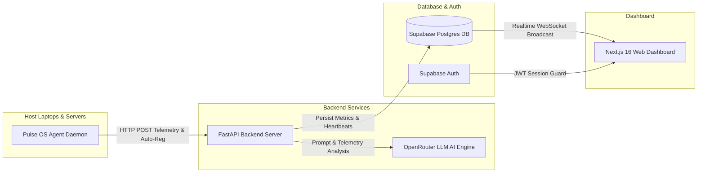

# Pulse OS 🚀

> **A Lightweight, Real-Time Distributed System & Machine Telemetry Monitoring Framework with OpenRouter AI Diagnostics**

Pulse OS is a modern SaaS-grade system telemetry platform designed to monitor remote computers and laptops in real time. It consists of a lightweight cross-platform background agent (`psutil`), a robust FastAPI backend service connected to Supabase Postgres, and an agency-tier Next.js 16 App Router dashboard featuring live metric charts, automated node management, and OpenRouter AI telemetry diagnostics.

---

## ✨ Features

- ⚡ **Real-Time Telemetry Streaming**: Continuously streams CPU, Memory (RAM), Disk capacity, and process load every 5 seconds.
- 🤖 **OpenRouter AI Diagnostics**: Integrated AI performance analyzer powered by free OpenRouter LLM models (`meta-llama/llama-3.1-8b-instruct:free`, `google/gemini-2.0-flash-exp:free`, etc.) with rule-engine fallback.
- 💻 **Smart Host Agent**:
  - Auto-registration of new machines on first boot.
  - Automatic secret key generation (`MACHINE_KEY`) and local persistence.
  - Process name normalization (e.g. `chrome.exe` → `Google Chrome`, `Code.exe` → `Visual Studio Code`).
  - Top 20 individual active process tracking with non-idle resource load sorting.
- 🔴 **Automatic 45-Second Offline Detection**: Automatically detects when host agents stop sending data and marks machines offline in real time.
- 🔐 **Supabase Authentication**: Protects dashboard routes with Email/Password & Google OAuth sign-in.
- 🎨 **High-End Doppelrand UI/UX**: Premium light theme featuring double-bezel glassmorphic cards, smooth Recharts timelines, custom status badges, and interactive delete confirmation modals.
- 📦 **Automated CI/CD Executable Building**: Includes a GitHub Actions workflow that compiles `PulseOS-Agent.exe` for Windows on every commit.

---

## 🛠 Tech Stack

| Component | Technologies & Libraries |
| :--- | :--- |
| **Frontend** | Next.js 16 (App Router), TypeScript, Tailwind CSS, Recharts, Framer Motion, Phosphor Icons |
| **Backend** | Python 3.11+, FastAPI, Uvicorn, Pydantic, Supabase Python Client (`supabase-py`), Requests |
| **Agent** | Python 3.11+, `psutil`, `python-dotenv`, PyInstaller |
| **Database & Auth** | Supabase Postgres, Supabase Auth, Supabase Realtime WebSockets |
| **AI Diagnostics** | OpenRouter Chat Completions API (Free LLM Models) |
| **CI/CD** | GitHub Actions (`windows-latest`, PyInstaller) |

---

## 🏗 System Architecture



---

## 📦 Project Structure

```text
PulseOs/
├── .github/
│   └── workflows/
│       └── build-windows-agent.yml   # GitHub Actions CI for automated Windows .exe builds
├── agent/                            # Cross-platform Python monitoring daemon
│   ├── collector.py                  # Telemetry harvester (CPU, RAM, Disk, Process normalization)
│   ├── sender.py                     # HTTP payload transmitter & retry mechanism
│   ├── main.py                       # Daemon entry point & configuration manager
│   ├── build_windows.bat             # One-click Windows batch builder
│   ├── requirements.txt              # Agent Python dependencies
│   └── README.md                     # Dedicated agent guide
├── backend/                          # FastAPI REST API service
│   ├── main.py                       # Telemetry ingestion, machine routes, & OpenRouter AI
│   ├── .env.example                  # Environment configuration template
│   └── requirements.txt              # Backend Python dependencies
├── frontend/                         # Next.js 16 App Router dashboard
│   ├── src/app/                      # Pages: Landing (/), Auth (/login), Fleet (/dashboard), Node (/machines/[id])
│   ├── src/components/               # UI: MachineCards, Recharts, ProcessTable, AIDiagnosticsCard, ConfirmDeleteModal
│   ├── src/context/                  # Supabase AuthContext provider
│   └── src/lib/                      # Supabase client setup & helper utilities
└── README.md                         # Main project documentation
```

---

## 🚀 How to Run Locally

### Prerequisites
- **Node.js** v18+ & **npm**
- **Python** 3.9+
- **Supabase** Project (URL & Service Role / Anon Key)

---

### 1. Backend Setup

```bash
cd backend
python3 -m venv venv
source venv/bin/activate       # On Windows: venv\Scripts\activate
pip install -r requirements.txt

# Create environment file from template
cp .env.example .env
```

Edit `backend/.env` with your Supabase credentials & OpenRouter key:
```env
SUPABASE_URL=https://your-project.supabase.co
SUPABASE_KEY=your-supabase-service-key
OPENROUTER_API_KEY=sk-or-v1-your-openrouter-key
PORT=8000
```

Start the FastAPI server:
```bash
python3 main.py
```
*The server will run on `http://localhost:8000`.*

---

### 2. Frontend Setup

```bash
cd frontend
npm install
```

Create `frontend/.env.local`:
```env
NEXT_PUBLIC_SUPABASE_URL=https://your-project.supabase.co
NEXT_PUBLIC_SUPABASE_ANON_KEY=your-supabase-anon-key
NEXT_PUBLIC_BACKEND_URL=http://localhost:8000
```

Launch the Next.js development server:
```bash
npm run dev
```
*Open `http://localhost:3000` in your web browser.*

---

### 3. Agent Setup

```bash
cd agent
python3 -m venv venv
source venv/bin/activate       # On Windows: venv\Scripts\activate
pip install -r requirements.txt

# Run the agent daemon
python3 main.py
```
*The agent will auto-generate a secret machine key on first run and start streaming metrics.*

---

## 🪟 How to Use the Windows Agent (`.exe`)

You can run the monitoring agent on any Windows laptop without installing Python!

### Option A: Download Pre-built `.exe` from GitHub Actions
1. Go to the **Actions** tab on your GitHub repository.
2. Select the latest successful **Build Pulse OS Agent (Windows .exe)** workflow run.
3. Download the **PulseOS-Agent-Windows** artifact zip.
4. Extract `PulseOS-Agent.exe` and `.env`.

### Option B: Build `.exe` Locally on Windows
Double-click `agent/build_windows.bat` or run:
```cmd
cd agent
pip install -r requirements.txt pyinstaller
pyinstaller --onefile --noconsole --name "PulseOS-Agent" --clean main.py
```
*The compiled binary will be placed inside `agent/dist/PulseOS-Agent.exe`.*

### Option C: Run on Target Laptop
1. Copy `PulseOS-Agent.exe` and `.env` to the target machine.
2. Edit `.env` to point `BACKEND_URL` to your central server IP or domain:
   ```env
   BACKEND_URL=http://192.168.1.100:8000
   POLL_INTERVAL=5
   ```
3. Double-click `PulseOS-Agent.exe`!
   - The process runs silently in the background.
   - Logs are continuously written to `agent.log`.

---

## 📸 Screenshots

*(Replace placeholders below with actual project screenshots)*

| Landing Page | Fleet Dashboard |
| :---: | :---: |
|  |  |

| Machine Detail & Live Recharts | OpenRouter AI Diagnostics |
| :---: | :---: |
|  |  |

---

## 🔮 Future Improvements

- [ ] **Custom Metric Alerts**: E-mail and Webhook notifications (Slack/Discord) when CPU or RAM exceeds 90% for > 2 minutes.
- [ ] **Historical Telemetry Export**: Export machine metric logs to CSV and JSON formats.
- [ ] **Multi-Tenant User Permissions**: Restrict machine visibility based on logged-in user organizations.
- [ ] **Remote Command Execution**: Secure terminal command interface to reboot or stop rogue processes directly from the web dashboard.
- [ ] **Linux systemd & macOS Launchd Service Scripts**: Installers to run the agent as a native system service on boot.

---

## 📄 License

This project is open-source under the [MIT License](LICENSE).
