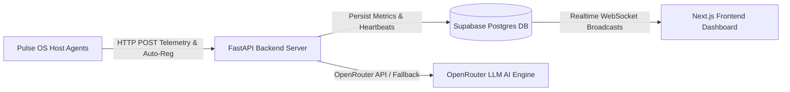

# Pulse OS 🚀

Pulse OS is a lightweight, real-time distributed system and machine metrics monitoring framework. It streams live node telemetry (CPU, RAM, Disk, active top processes) from host agents to a FastAPI backend service backed by Supabase Postgres, OpenRouter AI Diagnostics, and a Next.js App Router dashboard.

---

## 🏗 System Architecture



---

## 📦 Directory Structure

```
pulse-os/
├── .github/
│   └── workflows/
│       └── build-windows-agent.yml  # GitHub Actions CI for Windows .exe builds
├── agent/                           # Cross-platform Python monitoring daemon
│   ├── main.py                      # Entry point process & auto-registration
│   ├── collector.py                 # System resource harvester (psutil)
│   ├── sender.py                    # Telemetry transport & retry mechanism
│   ├── build_windows.bat            # One-click Windows PyInstaller batch builder
│   ├── requirements.txt             # Agent Python dependencies
│   └── README.md                    # Detailed agent setup & PyInstaller guide
├── backend/                         # FastAPI backend API
│   ├── main.py                      # REST endpoints, CORS, & OpenRouter AI
│   ├── .env.example                 # Environment template
│   └── requirements.txt             # Backend Python dependencies
├── frontend/                        # Next.js 16 App Router dashboard
│   ├── src/app/                     # Landing Page (/), Auth (/login), Dashboard (/dashboard)
│   ├── src/components/              # Double-bezel cards, Recharts, Process table, AI Diagnostics
│   └── src/context/                 # Supabase AuthContext
└── README.md                        # Project documentation
```

---

## 🗄 Database Schema (Supabase)

### 1. `machines`
Tracks registered hardware nodes and active status heartbeat.

| Column | Type | Constraints / Default | Description |
| :--- | :--- | :--- | :--- |
| `id` | `uuid` | Primary Key, `gen_random_uuid()` | Machine unique identifier |
| `name` | `text` | `NOT NULL` | Machine display name |
| `hostname` | `text` | | System hostname |
| `machine_key` | `text` | `UNIQUE, NOT NULL` | Unique authentication/node key |
| `last_seen` | `timestamptz` | | Heartbeat timestamp |
| `is_online` | `boolean` | `DEFAULT false` | Node online status indicator |
| `created_at` | `timestamptz` | `DEFAULT now()` | Record creation timestamp |
| `user_id` | `uuid` | References `auth.users(id)` | Owner user account reference |

### 2. `metrics`
Stores periodic time-series resource utilization telemetry.

| Column | Type | Constraints / Default | Description |
| :--- | :--- | :--- | :--- |
| `id` | `bigint` | `GENERATED ALWAYS AS IDENTITY`, PK | Metric row ID |
| `machine_id` | `uuid` | References `machines(id) ON DELETE CASCADE` | Associated node |
| `cpu_percent` | `real` | | CPU usage % |
| `ram_percent` | `real` | | Memory usage % |
| `ram_used_gb` | `real` | | Memory used in GB |
| `ram_total_gb` | `real` | | Total memory capacity in GB |
| `disk_percent` | `real` | | Root disk usage % |
| `processes` | `jsonb` | | Array of top processes JSON |
| `created_at` | `timestamptz` | `DEFAULT now()` | Telemetry timestamp |

---

## 🚀 Quickstart Guide

### 1. Backend Setup

```bash
cd backend
python3 -m venv venv
source venv/bin/activate
pip install -r requirements.txt

# Copy environment template & configure keys
cp .env.example .env

# Run FastAPI backend
python3 main.py
```
The API server will listen on `http://localhost:8000`.

### 2. Frontend Setup

```bash
cd frontend
npm install
npm run dev
```
The dashboard will open on `http://localhost:3000`.

### 3. Running the Agent on Host Machines

```bash
cd agent
python3 -m venv venv
source venv/bin/activate
pip install -r requirements.txt

# Run Agent daemon (auto-registers on first run)
python3 main.py
```
See [agent/README.md](file:///Users/shaikrafiqhuddin/Desktop/PulseOs/agent/README.md) for full instructions and single-binary PyInstaller packaging commands.

---

## 🤖 Pre-built Windows Executables (GitHub Actions)

You don't need Python installed on your target Windows machines to run the agent!

Every commit to `main` automatically builds a standalone `PulseOS-Agent.exe` via GitHub Actions:

1. Go to the **Actions** tab in your GitHub repository.
2. Select the latest **Build Pulse OS Agent (Windows .exe)** workflow run.
3. Scroll down to the **Artifacts** section at the bottom of the page.
4. Click **PulseOS-Agent-Windows** to download the zip file containing `PulseOS-Agent.exe` and `.env`.
5. Unzip, edit `BACKEND_URL` in `.env`, and double-click `PulseOS-Agent.exe`!
